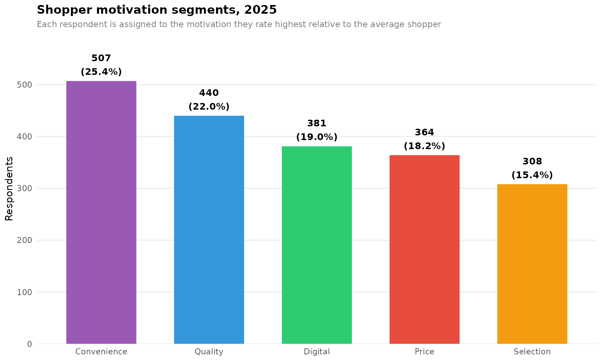
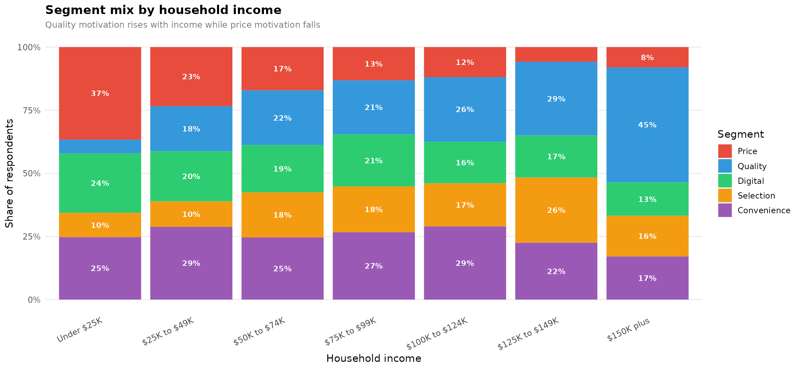
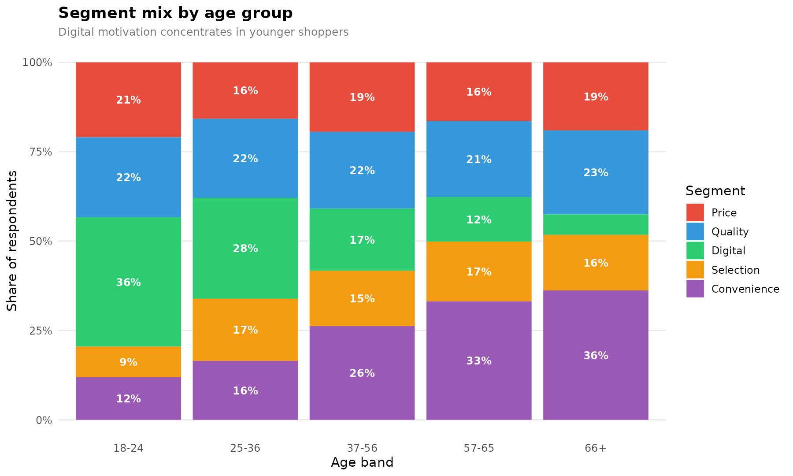
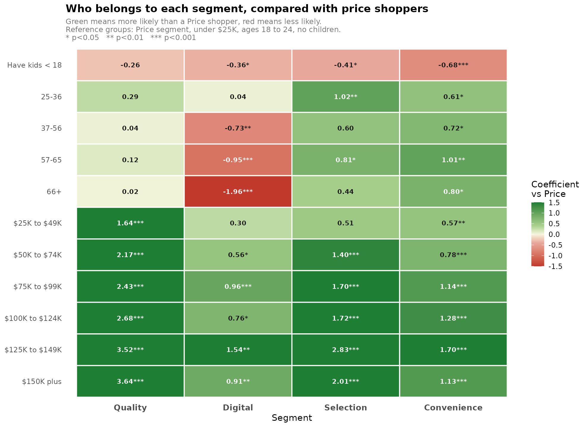
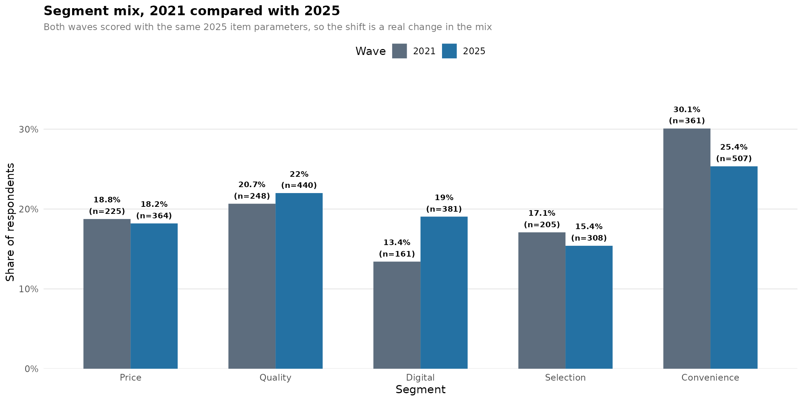

# Grocery Shopper Motivation Segmentation

Segmenting grocery shoppers by what actually drives their store choice, and then testing whether those segments can be found using information a retailer already has.

Built as a graduate capstone project for ALDI, in partnership with the McCombs School of Business at UT Austin. The code here runs on a synthetic dataset. See [Data and confidentiality](#data-and-confidentiality) below.

---

## The code

The pipeline runs in six stages. Each one is a single file and each answers one question.

| Stage | What it does |
|---|---|
| [`R/00_config.R`](R/00_config.R) | Settings, item groupings, demographic banding, chart styling |
| [`R/01_prepare_data.R`](R/01_prepare_data.R) | Parses the survey export, recodes answers, builds behavioural flags |
| [`R/02_factor_analysis.R`](R/02_factor_analysis.R) | Tests whether the 21 importance items collapse into distinct motivations |
| [`R/03_segment_scoring.R`](R/03_segment_scoring.R) | Standardises the items and assigns each respondent to a segment |
| [`R/04_multinomial_model.R`](R/04_multinomial_model.R) | Models segment membership against demographics |
| [`R/05_charts.R`](R/05_charts.R) | Builds the six charts |

[`run_all.R`](run_all.R) runs all six in order. Method decisions and their tradeoffs are in [`docs/methodology.md`](docs/methodology.md). Every column is documented in [`docs/data_dictionary.md`](docs/data_dictionary.md).

---

## The business question

Every grocery survey finds that shoppers care about price. That result is reliable and close to useless on its own, because it does not establish that "cares about price" means the same thing to everyone.

Two shoppers can both rate low prices as extremely important and still want completely different things. One is scanning weekly ads and stacking coupons. The other simply wants a small total at the register and does not want to work for it. A promotion built for the first shopper is wasted on the second.

So the project asked three questions:

1. Do grocery shoppers split into distinct motivation groups, or is price sensitivity one single spectrum?
2. If the groups exist, how big is each one?
3. Can a retailer identify which group a shopper belongs to from demographics alone, without asking them?

The third question is the one that decides whether any of this is commercially useful. A segment nobody can find is an academic result.

---

## Method

```
survey responses
      ↓
factor analysis            do the 21 importance items collapse into
                           a small number of distinct motivations?
      ↓
z score standardisation    convert absolute ratings into "how much
                           does this shopper stand out on this?"
      ↓
segment assignment         each respondent joins the dimension they
                           stand out on most
      ↓
multinomial logit          can demographics predict segment membership?
      ↓
charts                     six views for a non technical audience
```

### Why standardise before segmenting

The core measurement problem is that almost everyone rates almost everything as important. On a five point importance scale, the majority of respondents sit in the top two boxes for most items. Segmenting on raw scores would mostly sort people by how generously they use a rating scale.

Z scoring each item against the sample mean changes the question from "how important is this to you" to "how much more than the average shopper does this matter to you". A respondent who rates everything a five ends up near zero on every dimension, which is the correct answer: they told us nothing distinguishing.

### Why the scoring parameters are frozen

The survey ran in two waves, four years apart. To compare them, both waves are scored using the means and standard deviations calculated from the later wave only.

This matters more than it might appear. If each wave were standardised against itself, every wave would produce roughly the same segment sizes by construction, and any real change in the market would be scaled away. Freezing the parameters means both waves are measured against the same ruler, so a shift in the mix is an actual shift in shopper behaviour.

### Why multinomial logit

The outcome has five unordered categories. Ordinary logistic regression handles two. Treating the segment label as a number would invent an ordering that does not exist, since a Quality shopper is not "more" than a Digital shopper.

Multinomial logit estimates a separate set of coefficients for each segment against one reference category. Price is the reference here, so every coefficient reads as: compared with a price driven shopper who is otherwise identical, how much more or less likely is this person to belong to segment X.

Full reasoning, including the parts that were simplified for this public version, is in [`docs/methodology.md`](docs/methodology.md).

---

## Output

Charts produced by [`R/05_charts.R`](R/05_charts.R). Every figure below was generated by running this pipeline against the synthetic dataset, so the numbers illustrate what the analysis produces rather than what the study found.

**How big is each segment?**



**Does the mix change across the income distribution?**

Price motivation falls as income rises and quality motivation climbs to replace it. That much is unsurprising. The more useful detail is that price driven shoppers do not disappear at the top of the distribution, and quality driven shoppers are present at the bottom of it.



**Does it change with age?**

Digital motivation is the sharpest demographic gradient in the whole study.



**Can demographics predict segment membership?**

Green means more likely than a price driven shopper, red means less likely. This is the chart that decides whether the segmentation is commercially usable, because a segment nobody can locate cannot be targeted.



**Has the mix shifted between waves?**

Both waves are scored using the same item parameters, taken from the later wave only. Without that constraint each wave would be standardised against itself and any real movement in the market would be scaled away. See [`docs/methodology.md`](docs/methodology.md) for the full reasoning.



A sixth chart comparing households with and without children, plus the underlying result tables, factor loadings and scoring parameters, are in [`outputs_synthetic/`](outputs_synthetic).

---

## Reading the results

Two things are worth flagging, because they are the parts most likely to be over read.

**The model explains some of the variation, not most of it.** Demographics shift the odds of segment membership in the directions you would expect, and several effects are strongly significant. The model still classifies only a minority of respondents correctly. Income and age tell you where to weight a media buy. They do not tell you what any individual shopper wants.

**Not every respondent is cleanly segmented.** The assignment rule gives everyone a label, including people whose top two dimensions are effectively tied. The pipeline reports what share of respondents fall into that grey zone, because a campaign built on a label that was decided by a rounding error will underperform and nobody will know why.

---

## Running it

Requires R 4.0 or later.

```r
install.packages(c("readr", "dplyr", "tidyr", "stringr", "purrr",
                   "psych", "GPArotation", "nnet", "forcats",
                   "ggplot2", "scales"))
```

From the repository root:

```bash
Rscript run_all.R
```

Runs in under ten seconds and writes every table and chart to `outputs_synthetic/`.

To run a single stage, source `R/00_config.R` first, then the stages in order up to the one you want.

---

## Repository layout

```
R/                         the six pipeline stages, described above
run_all.R                  runs everything in order
data/
  sample_survey_data.csv   synthetic, 3,200 respondents across two waves
  make_sample_data.py      the script that generated it
docs/
  methodology.md           method decisions and their tradeoffs
  data_dictionary.md       every column, what it holds, how it is coded
outputs_synthetic/         generated tables and charts
```

---

## What I would do differently

**Test the segments against behaviour, not just against demographics.** Everything here comes from one survey instrument. The segments are derived from a respondent's stated importance ratings and then validated against that same respondent's other stated answers. That is internally consistent and it is not the same as being true. Joining the segment labels to loyalty card transaction data would have shown whether a Digital segment member actually shops differently, and I would treat that as the real validation step rather than a nice extra.

**Set the number of factors before looking at the data.** Parallel analysis and interpretability were both used to land on the factor count. Both are defensible, but running them after seeing the correlation structure leaves room for the count that produces the tidiest story. Pre registering the criterion would have removed that.

**Report assignment confidence in the deliverable, not just in the code.** The margin between a respondent's top two dimensions was calculated during analysis but the final charts show clean segment sizes. Those clean numbers are what stakeholders remember. A version of chart 1 that showed strongly assigned and weakly assigned respondents separately would have been less satisfying and more honest.

**Push back harder on the segment count.** Five dimensions came partly from the structure in the data and partly from the fact that the business already thought in those terms. Those two things reinforcing each other is comfortable and is not evidence.

---

## Tools

R for the full pipeline. `psych` for factor analysis, `nnet` for the multinomial model, `ggplot2` for charts, `dplyr` and `tidyr` throughout. Tableau was used separately for stakeholder facing dashboards. Large language models were used for code generation, debugging and chart iteration.

---

## Data and confidentiality

**The dataset in this repository is synthetic.** It was generated to match the structure of the original survey instrument: the same variables, the same answer formats, the same realistic pattern of item non response. The values themselves are simulated from a known latent structure. No real respondent data appears anywhere in this repository, and no ALDI figures, findings or recommendations are reproduced.

The generator is included at [`data/make_sample_data.py`](data/make_sample_data.py) so that claim can be checked rather than taken on trust.

Everything in `outputs_synthetic/` was generated by running this pipeline against the synthetic data. The numbers are illustrative of what the analysis produces. They are not the study's results.

The code, the method and the reasoning are mine. The survey data and the findings belong to ALDI and are not published here.

---

## License

MIT. See [LICENSE](LICENSE).
